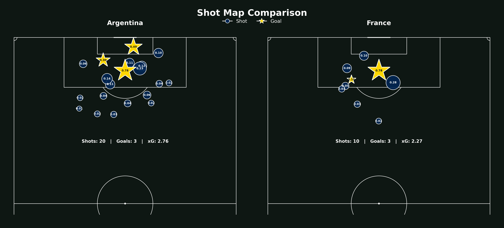

# ⚽ Argentina vs France — Shot Freeze Frame Analysis

An analysis of the **Argentina vs France 2022 FIFA World Cup Final**, using **StatsBomb open data** to explore shot locations, freeze frames, and chance creation.

### Shot Map

  

### 📊 What's inside?

This project explores the shots and attacking situations created throughout the match, using freeze-frame data to look beyond the final outcome and examine the **context behind each shot**.

The analysis includes visualizations and insights into:

* Shot locations and outcomes
* Chance creation
* Freeze-frame situations
* Attacking patterns
* Argentina vs France comparison

### 🔎 Explore the full analysis

The complete analysis and visual report is available as an interactive HTML document.

**👉 [View the Full Analysis Report](https://ahmoghimzadeh.github.io/shot_freeze_frame_analysis/)**

The report contains the full set of visualizations, analysis, and findings from the project.

---

**Data:** [StatsBomb Open Data](https://github.com/statsbomb/open-data)
**Match:** Argentina 🇦🇷 vs France 🇫🇷 — FIFA World Cup Final 2022
**Focus:** Shot & Freeze Frame Analysis
